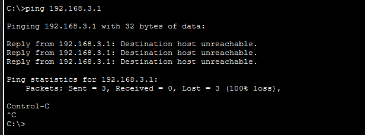
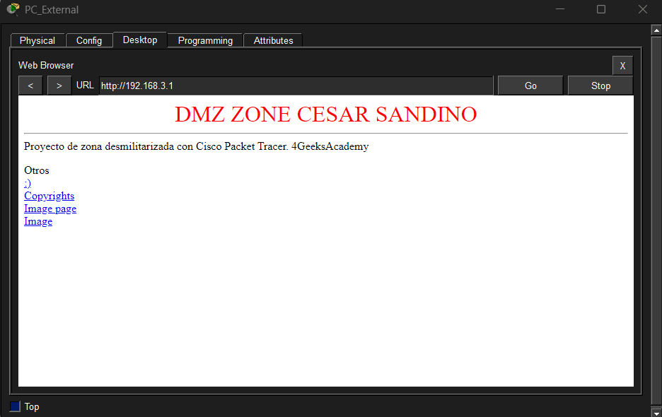
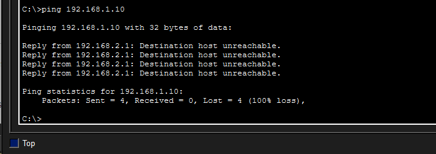

# Informe de configuración de DMZ con Cisco Packet Tracer - Cesar Sandino


### 1. Objetivo del laboratorio


Configurar una DMZ segura usando un router Cisco ISR, aplicando NAT y ACLs para controlar el tráfico entre LAN, DMZ y red externa.

---

### 2. Topología implementada

Esta topologia esta divida principalmente en tres zonas las cuales se controlan por un router central.
 
- **Red Interna (LAN)** Esta red es de acceso exclusivo para empleados internos de la corporación. 
- **DMZ (WEB)** Esta red es donde esta alojada el servidor web y la cual se aisló para evitar un acceso no autorizado desde esta red hacia la red interna. 
- **Red Externa (WAN)** Esta red representa el trafico que viene del exterior y host de internet 


### 3. Plan de direccionamiento IP


| Dispositivo             | IP               | Máscara           | Gateway           |
|-------------------------|------------------|-------------------|-------------------|
| PC_Internal             | 192.168.1.10     |  255.255.255.0    | 192.168.1.1       |
| Server_DMZ              | 192.168.1.10     |  255.255.255.0    | 192.168.2.1       |
| PC_External             | 192.168.1.10     |  255.255.255.0    | 192.168.3.1       |
| Router_FW Gi0/0 (LAN)   | 192.168.1.1      |  255.255.255.0    |                   |
| Router_FW Gi0/1 (DMZ)   | 192.168.2.1      |  255.255.255.0    |                   |
| Router_FW Gi0/2 (Ext)   | 192.168.3.1      |  255.255.255.0    |                   |


### 4. Configuración aplicada 

#### Configuración de NATs estaticas
Dominio NAT implementado para que el trafico externo pueda acceder al servidor interno (en este caso DMZ) sin exponer directamtente la red interna. ademas de la configuración de interfaces de sus respectivas redes.

- Interfaces configuradas con `ip address`

```Router_FW(config)# interface GigabitEthernet0/0

Router_FW(config-if)# ip address 192.168.1.1 255.255.255.0

Router_FW(config-if)# no shutdown

Router_FW(config-if)# exit


Router_FW(config)# interface GigabitEthernet0/1

Router_FW(config-if)# ip address 192.168.2.1 255.255.255.0

Router_FW(config-if)# no shutdown

Router_FW(config-if)# exit


Router_FW(config)# interface GigabitEthernet0/2

Router_FW(config-if)# ip address 192.168.3.1 255.255.255.0

Router_FW(config-if)# no shutdown

Router_FW(config-if)# exit

```

- NAT:
```
Router_FW# configure terminal

Router_FW(config)# interface GigabitEthernet0/1

Router_FW(config-if)# ip nat inside  

Router_FW(config-if)# exit


Router_FW(config)# interface GigabitEthernet0/2

Router_FW(config-if)# ip nat outside 

Router_FW(config-if)# exit


Router_FW(config)# ip nat inside source static 192.168.2.10 192.168.3.1

Router_FW(config)# end
```
- ACLs:
```
access-list 101 permit tcp any host 192.168.3.1 eq 80

access-list 100 deny ip 192.168.2.0 0.0.0.255 192.168.1.0 0.0.0.255
```


### 5. Verificaciones realizadas

- `ping` desde PC_Internal al servidor web: 



- Acceso web desde PC_External: ✅




- Bloqueo de acceso desde DMZ a LAN: ✅



### 6. Conclusiones y recomendaciones

Se logró implementar con exito direcciones nat estaticas, ACLs e interfaces de redes permitiendo mitigar riesgos de intrusion y aislando el servidor web evitando movimientos laterales, evitando en caso de comprometerse el servidor no signifique una brecha en la seguridad interna de la organización 

Nota:
Al aprender sobre las listas de acceso me di cuenta que una manera profesional seria usando ACLs nombradas y no con numeros de grupos, hace mas facil la identificación de las listas y mejor administrable

